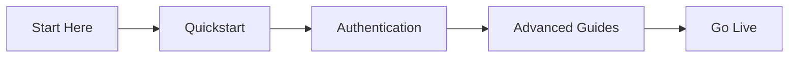

<Callout kind="info" title="Starter Kit Template">
  This documentation was generated as a starter kit template based on your brand. Please review and customize the content to accurately reflect your product's features, APIs, and capabilities.
</Callout>

## Overview

Test provides a centralized space for your project documentation. You can create, organize, and collaborate on docs using Markdown, MDX, and interactive components. Search across all content, version history, and integrate with your workflows seamlessly.

This platform scales with your team, supporting everything from quick notes to comprehensive API references. Start by exploring the key features below.

## Key Features

Test offers powerful tools to streamline your documentation process.

<Columns cols={3}>
  <Card title="Interactive Components" icon="components" href="#interactive-components">
    Use components like Steps, Tabs, and Cards to create engaging docs.
  </Card>
  <Card title="Version Control" icon="git-branch" href="#version-control">
    Track changes with built-in Git integration and history.
  </Card>
  <Card title="Search & Navigation" icon="search" href="#navigation">
    Full-text search and sidebar navigation for quick access.
  </Card>
</Columns>

## Quick Start

Get up and running in minutes.

<Steps>
  <Step title="Create Account" icon="user-plus">
    Sign up at `https://app.test.com/register` with your email.
  </Step>
  <Step title="New Workspace" icon="plus">
    Create a new documentation workspace for your project.
  </Step>
  <Step title="Add First Doc" icon="file-text">
    Click "New Page" and start writing in Markdown.
  </Step>
  <Step title="Publish" icon="globe">
    Preview and publish your docs live.
  </Step>
</Steps>

<CodeGroup tabs="Markdown,MDX">
  ```markdown
  # My First Doc

  Welcome to Test!

  - List item 1
  - List item 2
  ```
  ```mdx
  import { Callout } from 'components';

  <Callout kind="success">
    Your first MDX page!
  </Callout>
  ```
</CodeGroup>

## Benefits of Using Test

Discover why teams choose Test for documentation.

<Tabs>
  <Tab title="Teams" icon="users">
    Collaborate in real-time with comments and @mentions. Role-based access keeps content secure.
  </Tab>
  <Tab title="Developers" icon="code">
    Embed live code examples and API references. Supports syntax highlighting for 50+ languages.
  </Tab>
  <Tab title="Marketers" icon="layout">
    Custom themes and branding. Export to PDF or integrate with your site.
  </Tab>
</Tabs>

<Callout kind="tip">
  Benefits include reduced documentation time by 40% and improved team knowledge sharing.
</Callout>

## Navigation Guide

Explore these sections next:

<Columns cols={2}>
  <Card title="Quickstart" icon="zap" href="/quickstart">
    Set up your first workspace.
  </Card>
  <Card title="Authentication" icon="shield" href="/authentication">
    Secure your docs.
  </Card>
  <Card title="Guides" icon="book-open" href="/guides">
    Advanced topics.
  </Card>
  <Card title="Changelog" icon="git-commit" href="/changelog">
    What's new.
  </Card>
</Columns>



Ready to begin? Head to the [Quickstart](/quickstart) page.